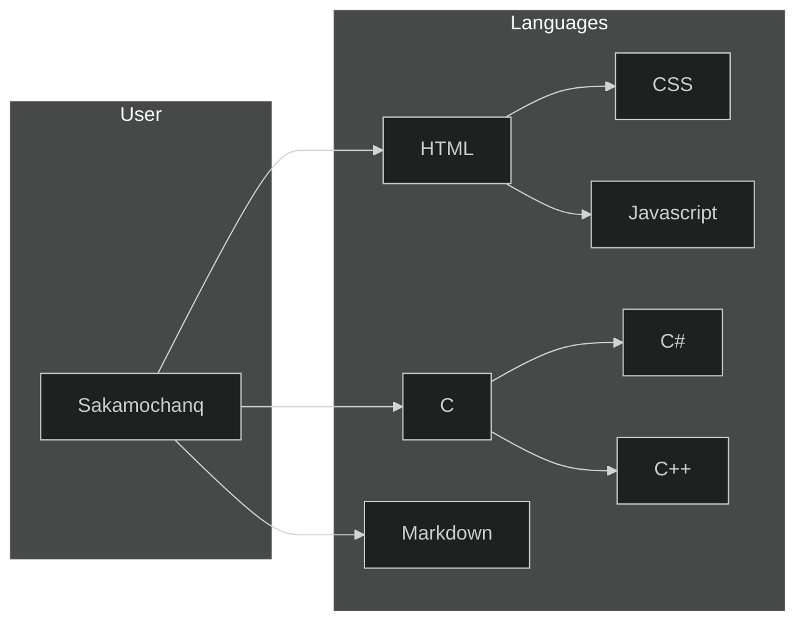

  

### 
Hi there, I'm Sakamochanq 😋

### 
[Sakamochanq.github.io](https://sakamochanq.github.io/)

  
### 
😊 I'm very busy right now

 
 

```mermaid
graph LR

  %%{init: {"theme" : "dark" }}%%

  subgraph "User"
    A-1[Sakamochanq]

  end

  subgraph "Languages"
    A-1 --> B-1[HTML]
    B-1 --> C-1[CSS]
    B-1 --> C-2[Javascript]
    A-1 --> B-2[C]
    B-2 --> C-3[C#]
    B-2 --> C-4[C++]
    A-1 --> B-3[Markdown]

  end
```
---
