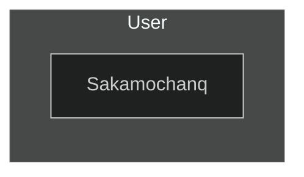

  

**
Hi there, I'm Sakamochanq 😋
**

**
[Sakamochanq.github.io](https://sakamochanq.github.io/)
**

 **
😊 I'm very busy right now
**

---

  <table align="center">
    <tr>
      <!--------------------------------------->
      <td align="center" width="96">
         MySQL
      </td>
      <!--------------------------------------->
      <td align="center" width="96">
         Javascript
      </td>
      <!--------------------------------------->
      <td align="center" width="96">
         C#
      </td>
      <!--------------------------------------->
    </tr>
  </table>

<!--

-->
